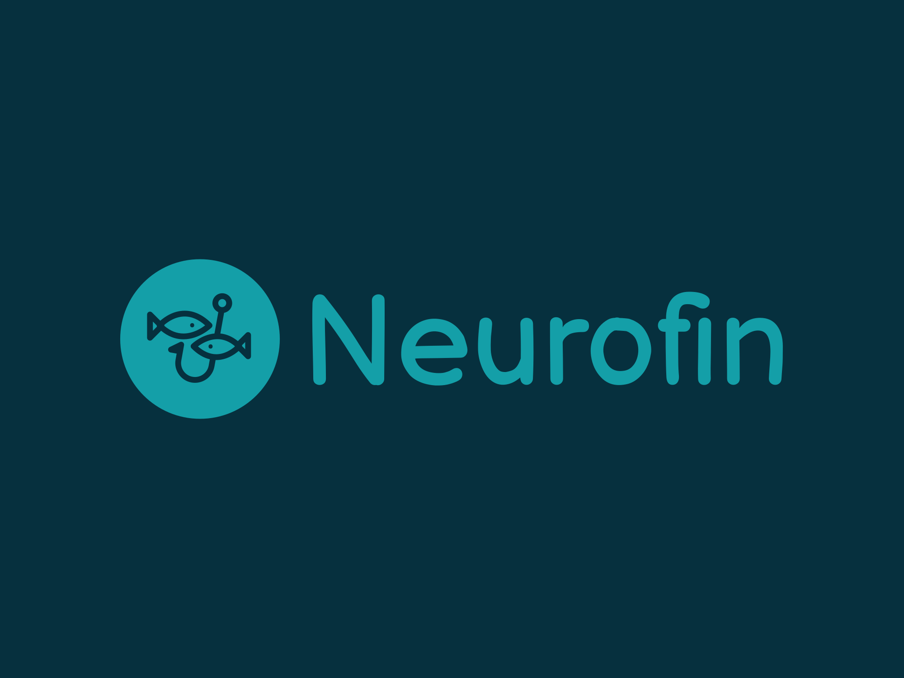

# NeuroFin: Intelligent Fish Classification using Transfer Learning

## 📌 Project Overview

**NeuroFin** is an image classification project that accurately identifies and classifies fish species across **9 distinct categories** using deep learning. Leveraging the power of **Transfer Learning** with **MobileNetV3-Large**, this project achieves an impressive **90% validation accuracy**.

The model is trained on a curated fish image dataset taken from Kaggle and built using **TensorFlow** and **Keras**, with techniques like data augmentation and fine-tuning to boost model performance.

---

## 🐟 Dataset

* The dataset includes images of 9 different fish species.
* Images had to be:
  * Organized into category-wise folders
  * Split into training and validation datasets using an 80:20 ratio
* Preprocessing included filtering zero-byte images and applying data augmentation to increase robustness.

### [Kaggle Dataset Link](https://www.kaggle.com/datasets/crowww/a-large-scale-fish-dataset)

---

## 🧠 Model Architecture

* **Base Model:** MobileNetV3-Large (pretrained on ImageNet)
* **Custom Layers:**
  * Global Average Pooling
  * Dense Layers: 512 → 256 → 128 neurons (ReLU activation)
  * Final Layer: 9 neurons (Softmax activation for multi-class classification)
* **Training Configuration:**

  * Optimizer: Adam with learning rate = 0.0001
  * Loss: Categorical Crossentropy
  * Epochs: 5

---

## 📈 Performance

* **Validation Accuracy:** \~90%
* The model demonstrates reliable generalization across unseen validation data.

---

